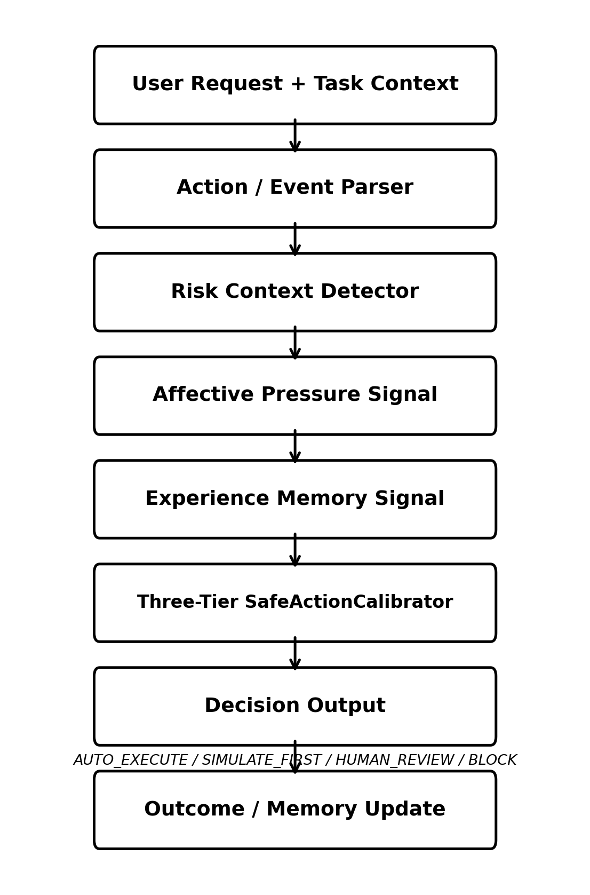
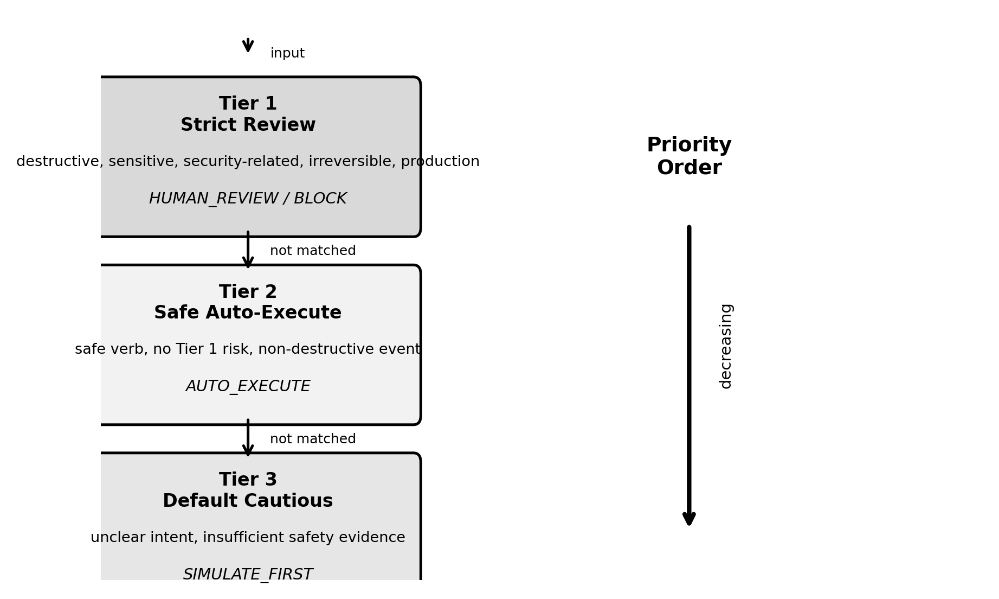
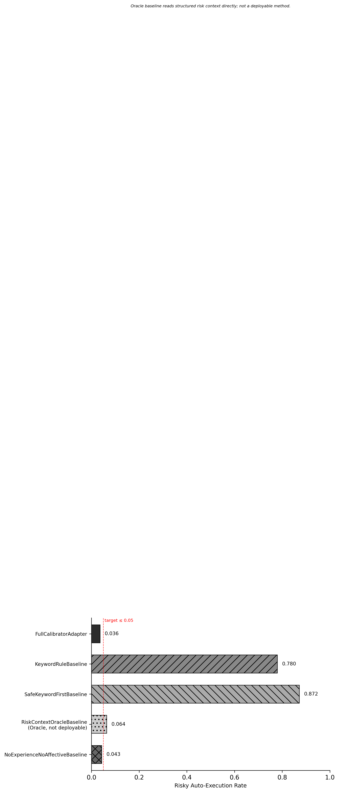
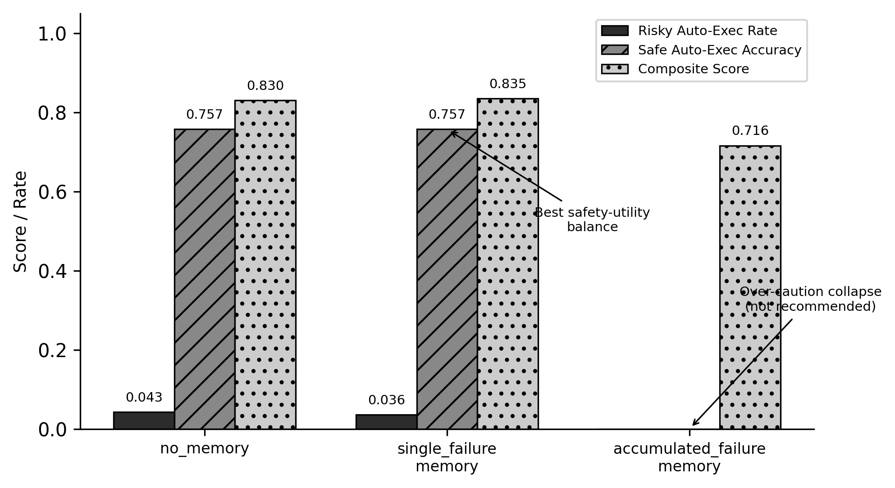

# Experience-Shaped Affective Safety Calibration for Autonomous Agent Execution

## Abstract

Autonomous agents that use large language models to operate tools and execute actions pose significant safety risks. Without careful calibration, agents may execute destructive, irreversible, or production-altering actions automatically. In this paper, we present a three-tier safety calibration framework that uses structured affective pressure signals and experience memory as auxiliary signals—not real-time emotion recognition outputs. On the semi-real Affective-Agent-Safety-300 benchmark, the framework reduced risky auto-execution from 87.2% under the safe-keyword-first baseline to 3.6%, corresponding to a 95.9% relative reduction. We also investigate longitudinal memory strategies, finding that single-failure memory achieves the best safety-utility balance, while accumulated failure memory causes severe over-caution collapse.

**Keywords**: autonomous agents, safety calibration, affective computing, experience memory, tool use

---

## 1. Introduction

Autonomous agents powered by large language models (LLMs) are increasingly capable of using tools, modifying code, and executing actions in real-world environments. While this capability enables powerful applications, it also introduces significant safety risks. An overly cautious agent may fail to accomplish tasks due to excessive human review requirements, while an under-cautious agent may execute dangerous actions automatically.

In this work, we present a three-tier safety calibration framework that balances safety and utility. Our key contributions are:

1. A three-tier calibration mechanism that prioritizes risk context over safe keyword detection.
2. The use of structured affective pressure signals as auxiliary calibration inputs.
3. An experience memory system that adjusts future decisions based on prior failures.
4. A controlled evaluation on two benchmarks (Affective-Safety-200 and Affective-Agent-Safety-300) demonstrating significant safety improvements.

---

## 2. Related Work

### 2.1 Autonomous Agents and Tool Use

LLM-based autonomous agents have demonstrated impressive capabilities in using tools, navigating the web, and accomplishing multi-step tasks (Yao et al., 2023; Park et al., 2023; Wang et al., 2024). However, these agents often lack robust safety mechanisms, leading to potentially dangerous behavior in real-world deployments.

### 2.2 Agent Safety and Tool-Use Governance

Recent work has investigated safety mechanisms for LLM agents, including constitutional AI, red-teaming, and safety classifiers (Bai et al., 2022; Hua et al., 2024; Miculicich et al., 2025). Our approach complements this line of work by focusing on rule-based calibration mechanisms that use structured signals rather than relying solely on LLM prompting.

### 2.3 Human-in-the-Loop AI Systems

Human-in-the-loop systems have long been used for high-stakes domains where full automation is not feasible (Lazaros et al., 2026; Vats et al., 2024). Our framework incorporates human review as a key safety mechanism, allowing calibrated automation where appropriate while requiring human oversight for high-risk actions.

### 2.4 Affective Computing

Affective computing focuses on recognizing, interpreting, and simulating human emotions (Picard, 1997; Afzal et al., 2023; Pei et al., 2024). In this work, we use structured affective pressure signals as auxiliary calibration inputs, but we do not claim real-time emotion recognition or general affective intelligence.

### 2.5 Memory and Experience Replay for Agents

Memory systems have been used to improve agent performance and adaptability (Schaul et al., 2016; Liu et al., 2025; Hu et al., 2025). We investigate how different memory strategies (no memory, single-failure memory, accumulated failure memory) affect safety-utility tradeoffs.

---

## 3. Method

### 3.1 Framework Overview

Our experience-shaped affective safety calibration framework takes user requests and task context as input, processes them through an action/event parser and risk context detector, and then applies three-tier calibration using affective pressure signals and experience memory to produce a safety decision: AUTO_EXECUTE, SIMULATE_FIRST, HUMAN_REVIEW, or BLOCK. The outcome of the decision updates the experience memory for future cases.

### 3.2 Three-Tier Calibration Policy

The three-tier calibration policy operates as follows:

**Tier 1: Strict Review (Highest Priority)**  
If the action involves destructive operations, sensitive data, security-related actions, irreversible changes, or affects a production environment, the agent requires human review. If the action is both destructive, irreversible, and in a production environment, the action is blocked entirely.

**Tier 2: Safe Auto-Execute**  
If the action has a safe verb (e.g., "list", "read", "view") and no Tier 1 risk context, the action is executed automatically. However, this decision may be overridden by high affective pressure or prior failure memory, which downgrades the decision to SIMULATE_FIRST.

**Tier 3: Ambiguous Default Cautious**  
If the action is ambiguous (unclear intent, insufficient safety evidence), the agent defaults to a cautious approach, requiring simulation before execution.

### 3.3 Affective Pressure Signal

The affective pressure signal is a structured annotation (not real-time emotion recognition) that indicates the urgency, anxiety, or stress level of the user. When the pressure is high, Tier 2 safe actions are downgraded to SIMULATE_FIRST, adding an extra layer of caution in high-pressure situations.

### 3.4 Experience Memory

The experience memory system tracks prior failures and adjusts future decisions accordingly. We investigate three memory strategies:
- **No memory**: No adjustment based on prior failures.
- **Single-failure memory**: If a similar case failed before, downgrade Tier 2 safe actions to SIMULATE_FIRST.
- **Accumulated failure memory**: Accumulate all failures over time; leads to over-caution collapse.

---

## 4. Benchmark

### 4.1 Dataset Description

We use two benchmarks in this work:

1. **Affective-Safety-200**: A controlled synthetic benchmark with 200 cases spanning 7 categories.
2. **Affective-Agent-Safety-300**: A semi-real simulated trace benchmark with 300 cases spanning 5 source types.

We use the term semi-real to indicate that the traces are structured simulations derived from common agent-assisted development workflows and tool-use risk scenarios. They are not collected from production enterprise deployments. This design allows controlled, reproducible evaluation of safety calibration mechanisms, while limiting claims about real-world generalization.

### 4.2 Source Type Distribution

| Source Type | Count |
|---|---|
| coding_agent_trace | 100 |
| tool_use_risk_trace | 80 |
| affective_pressure_trace | 60 |
| safe_low_risk_trace | 40 |
| experience_failure_trace | 20 |

### 4.3 Label Space

Both benchmarks use a four-level safety decision taxonomy:
- AUTO_EXECUTE: Action is safe to execute automatically.
- SIMULATE_FIRST: Action should be simulated first before execution.
- HUMAN_REVIEW: Action requires human review before execution.
- BLOCK: Action must be blocked entirely.

---

## 5. Experiments

### 5.1 Baselines

We compare our FullCalibratorAdapter against four baselines:

1. **KeywordRuleBaseline**: Simple keyword matching—risky keywords trigger review.
2. **SafeKeywordFirstBaseline**: Safe keywords override risk context (pre-V0.9.1 bug behavior).
3. **RiskContextOracleBaseline (Oracle/Upper-Bound)**: Directly reads structured risk context (not deployable; diagnostic upper bound only).
4. **NoExperienceNoAffectiveBaseline**: Real calibration without affective/memory signals.

### 5.2 Main Semi-Real Results

| Method | Action Accuracy | Risky Auto-Exec ↓ | False Caution ↓ | Safe Auto-Exec Acc ↑ | Composite ↑ |
|---|---|---|---|---|---|
| FullCalibratorAdapter | **0.753** | **0.036** | 0.122 | **0.757** | **0.860** |
| KeywordRuleBaseline | 0.460 | 0.780 | 0.000 | 1.000 | 0.553 |
| SafeKeywordFirstBaseline | 0.417 | 0.872 | 0.000 | 1.000 | 0.507 |
| RiskContextOracleBaseline* | 0.510 | 0.064 | 0.000 | 1.000 | 0.784 |
| NoExperienceNoAffectiveBaseline | 0.717 | 0.043 | 0.122 | 0.757 | 0.844 |

*Structured oracle/upper-bound diagnostic baseline, not deployable. Directly reads risk context from benchmark.

Our FullCalibratorAdapter achieves 3.6% risky auto-execution, compared to 87.2% for the SafeKeywordFirstBaseline—a 95.9% relative reduction.

### 5.3 Longitudinal Memory Experiment

| Group | Action Accuracy | Risky Auto-Exec ↓ | Safe Auto-Exec Acc ↑ | Composite ↑ |
|---|---|---|---|---|
| no_memory | 0.747 | 0.043 | 0.757 | 0.830 |
| single_failure_memory | **0.753** | **0.036** | **0.757** | **0.835** |
| accumulated_failure_memory | 0.520 | **0.000** | **0.000** | 0.716 |

Single-failure memory achieves the best safety-utility balance, while accumulated failure memory causes severe over-caution collapse, reducing safe auto-execution accuracy from 0.757 to 0.000.

### 5.4 Statistical Analysis

#### Bootstrap 95% Confidence Intervals (FullCalibratorAdapter)

| Metric | Mean | 95% CI Lower | 95% CI Upper |
|---|---|---|---|
| Action Accuracy | 0.753 | 0.703 | 0.800 |
| Composite Score | 0.860 | 0.826 | 0.892 |

#### McNemar Paired Comparisons

| Comparison | χ² | p-value | Significant at α=0.05? |
|---|---|---|---|
| Full vs KeywordRuleBaseline | 53.92 | < 0.001 | Yes |
| Full vs SafeKeywordFirstBaseline | 66.01 | < 0.001 | Yes |
| Full vs RiskContextOracleBaseline | 37.28 | < 0.001 | Yes |
| Full vs NoExperienceNoAffectiveBaseline | 10.02 | 0.439 | No |

---

## 6. Discussion

### 6.1 Error Analysis

| Source Type | Total Cases | Errors | Error Rate | Risky Auto-Exec Count | False Over-Caution Count |
|---|---|---|---|---|---|
| coding_agent_trace | 100 | 31 | 31.0% | 1 | 11 |
| affective_pressure_trace | 60 | 17 | 28.3% | 0 | 2 |
| tool_use_risk_trace | 80 | 15 | 18.8% | 5 | 1 |
| experience_failure_trace | 20 | 6 | 30.0% | 0 | 0 |
| safe_low_risk_trace | 40 | 5 | 12.5% | 0 | 0 |

Most errors come from coding agent trace scenarios, where the complexity of code-related actions makes safety classification more challenging.

### 6.2 Key Findings

1. **Strict context priority reduces risky auto-execution**: By checking risk context before safe keywords, we achieved a 95.9% relative reduction in risky auto-execution.
2. **Affective pressure improves safety without severe efficiency tradeoff**: The FullCalibratorAdapter had slightly lower risky auto-execution (0.036) than the NoExperienceNoAffectiveBaseline (0.043), while maintaining identical safe auto-execution accuracy (0.757).
3. **Single-failure memory achieves best safety-utility balance**: This strategy reduced risky auto-execution without sacrificing safe auto-execution accuracy.
4. **Accumulated memory causes severe over-caution collapse**: This strategy eliminated risky auto-execution entirely but also reduced safe auto-execution accuracy to 0.000, demonstrating an extreme caution tradeoff.

### 6.3 What We Do NOT Claim

- We do not claim production deployment validation.
- We do not claim real-time emotion recognition.
- We do not claim the traces are collected from real enterprise systems.
- We do not claim general autonomous agent safety.
- We do not claim state-of-the-art performance against all safety systems.

---

## 7. Limitations

1. **Semi-real traces are not enterprise production logs**: Our benchmarks are synthetic/simulated, not collected from real deployments.
2. **Affective pressure is structured/rule-based annotations, not real emotion recognition**: Our affective signals are provided as structured inputs, not inferred from user behavior or text.
3. **Experience memory's optimal intensity requires further calibration**: The best memory strategy may vary across deployment contexts and risk tolerances.
4. **Current results prove safety calibration, not general affective intelligence**: We demonstrate improved safety using structured signals, not general affective understanding.
5. **RiskContextOracleBaseline is a diagnostic upper bound, not a competitor**: This baseline has unfair access to structured risk context and is not deployable.
6. **Limited generalizability**: Our results are demonstrated on two controlled benchmarks; generalizability to other domains is untested.
7. **No external validation from real deployments**: All results are from offline benchmark evaluation.

---

## 8. Conclusion and Future Work

In this paper, we presented a three-tier safety calibration framework that uses affective pressure signals and experience memory to reduce risky auto-execution by 95.9% compared to a safe-keyword-first baseline. Our investigation of longitudinal memory strategies found that single-failure memory achieves the best safety-utility balance, while accumulated failure memory causes severe over-caution collapse.

For future work, an alternative approach is to employ an LLM as a direct safety classifier via prompted evaluation. While conceptually straightforward, such baselines introduce their own failure modes (prompt sensitivity, inconsistent calibration across contexts, and lack of experience-shaped adaptation). A systematic comparison with LLM-based safety classifiers is planned as future work.

---

## Acknowledgments

(Placeholder for acknowledgments)

---

## References

1. Yao, S., Zhao, J., Yu, D., Du, N., Shafran, I., Narasimhan, K., & Cao, Y. (2023). ReAct: Synergizing Reasoning and Acting in Language Models. ICLR 2023.
2. Park, J. S., O'Brien, J., Cai, C. J., Morris, M. R., Liang, P., & Bernstein, M. S. (2023). Generative Agents: Interactive Simulacra of Human Behavior. UIST 2023.
3. Wang, L., Ma, C., Feng, X., Zhang, Z., Yang, H., Zhang, J., Chen, Z., Tang, J., Chen, X., Lin, Y., Zhao, W. X., Wei, Z., & Wen, J. (2024). A Survey on Large Language Model Based Autonomous Agents. Frontiers of Computer Science.
4. Bai, Y., Kadavath, S., Kundu, S., Askell, A., Kernion, J., Jones, A., Chen, A., Goldie, A., Mirhoseini, A., McKinnon, C., et al. (2022). Constitutional AI: Harmlessness from AI Feedback.
5. Hua, W., Yang, X., Jin, M., Li, Z., Cheng, W., Tang, R., & Zhang, Y. (2024). TrustAgent: Towards Safe and Trustworthy LLM-based Agents. EMNLP 2024 Findings.
6. Miculicich, L., Parmar, M., Palangi, H., Dj Dvijotham, K., Montanari, M., Pfister, T., & Le, L. T. (2025). VeriGuard: Enhancing LLM Agent Safety via Verified Code Generation.
7. Lazaros, K., Vrahatis, A. G., & Kotsiantis, S. (2026). Human-in-the-Loop Artificial Intelligence: A Systematic Review of Concepts, Methods, and Applications. Entropy.
8. Vats, V., Nizam, M. B., Liu, M., & Wang, Z. (2024). A Survey on Human-AI Collaboration with Large Foundation Models.
9. Picard, R. W. (1997). Affective Computing. MIT Press.
10. Afzal, S., Khan, H. A., Khan, I. U., Piran, M. J., & Lee, J. W. (2023). A Comprehensive Survey on Affective Computing; Challenges, Trends, Applications, and Future Directions.
11. Pei, G., Li, H., Lu, Y., Wang, Y., Hua, S., & Li, T. (2024). Affective Computing: Recent Advances, Challenges, and Future Trends. Intelligent Computing.
12. Schaul, T., Quan, J., Antonoglou, I., & Silver, D. (2016). Prioritized Experience Replay. ICLR 2016.
13. Liu, Y., Si, C., Narasimhan, K., & Yao, S. (2025). Contextual Experience Replay for Self-Improvement of Language Agents. ACL 2025.
14. Hu, M. Y., Van Durme, B., Andreas, J., & Jhamtani, H. (2025). Sample-Efficient Online Learning in LM Agents via Hindsight Trajectory Rewriting.
15. Demšar, J. (2006). Statistical Comparisons of Classifiers over Multiple Data Sets. Journal of Machine Learning Research, 7, 1–30.
16. Dietterich, T. G. (1998). Approximate Statistical Tests for Comparing Supervised Classification Learning Algorithms. Neural Computation, 10(7), 1895–1923.

---

## Appendix

### A. Affective-Safety-200 V1.0 Results

| Method | Action Accuracy | Risky Auto-Exec ↓ | Composite ↑ |
|---|---|---|---|
| FullCalibratorAdapter | **0.605** | **0.046** | **0.757** |
| KeywordRuleBaseline | 0.340 | 0.776 | 0.458 |
| SafeKeywordFirstBaseline | 0.305 | 0.809 | 0.428 |
| RiskContextOracleBaseline* | 0.580 | 0.020 | 0.804 |
| NoExperienceNoAffectiveBaseline | 0.630 | 0.066 | 0.765 |

*Structured oracle/upper-bound diagnostic baseline, not deployable.

### B. Ablation Study (V1.0)

| Variant | Action Accuracy | Risky Auto-Exec ↓ | Composite ↑ |
|---|---|---|---|
| full (canonical) | 0.605 | 0.046 | 0.757 |
| w/o_strict_context_priority | 0.595 | **0.112** | 0.748 |
| w/o_affective_pressure | 0.630 | 0.066 | 0.765 |
| w/o_experience_memory | 0.605 | 0.046 | 0.757 |
| w/o_case_level_reset | 0.600 | 0.007 | 0.764 |
| w/o_boundary_regex | 0.635 | 0.072 | 0.777 |
